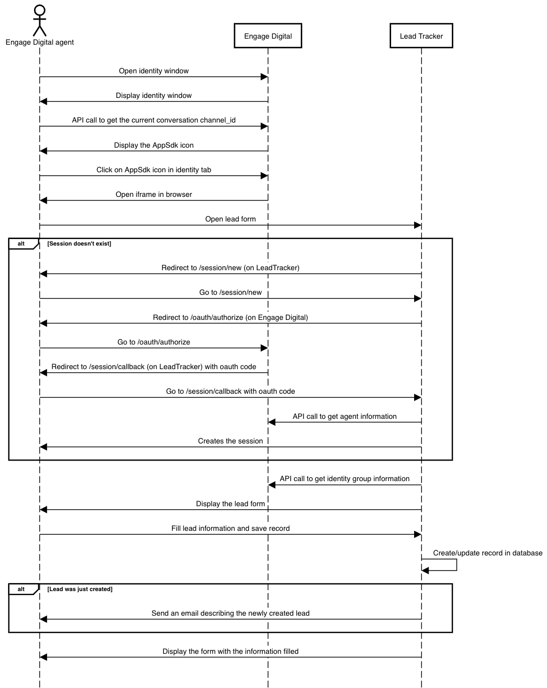

# Lead Tracker
- [Overview](#overview)
  - [Introduction](#introduction)
  - [Interaction with Engage Digital](#interaction-with-engage-digital)
  - [Database architecture](#database-architecture)
    - [Lead](#lead)
- [Setup](#setup)
  - [Dependencies](#dependencies)
  - [Kickstart](#kickstart)
  - [Engage Digital App SDK](#engage-digital-app-sdk)
  - [Environment variables](#environment-variables)
  - [Dynamic form configuration](#dynamic-form-configuration)
  - [Mailgun](#mailgun)

<br/>

## Overview

### Introduction

This project is a POC for lead management integration in Engage Digital. It relies on Engage Digital AppSDK to display a form for lead creation to agent handling interaction. The form can be customized based on the current channel where the interaction is taking place (see [Dynamic form configuration](#dynamic-form-configuration)).

The data themselves are stored in a database of this application serving the forms to agent in ED. This is the application handles form generation, fetching default value for lead from ED API, lead generation storage and SSO authentication with Engage Digital (only ED agent will be able to display the form). 

Engage Digital AppSDK application (to be setup in Engage Digital) provides the glue to interface this application to Engage Digital agent UI, provides proper data as parameter of this application and display form in ED UI as an iframe.

### Interaction with Engage Digital



<br/>

### Database architecture

#### Lead

| Name               | Type     | Description                                                                   |
|--------------------|----------|-------------------------------------------------------------------------------|
| id                 | Integer  | Unique identifier                                                             |
| identity_group_id  | String   | Unique identifier for the identity group on Engage Digital                    |
| entity             | String   | Name of the entity (based on the configuration file)                          |
| firstname          | String   | -                                                                             |
| lastname           | String   | -                                                                             |
| email              | String   | -                                                                             |
| phone_number       | String   | -                                                                             |
| question           | String   | -                                                                             |
| comment_summary    | String   | -                                                                             |
| lead_type          | String   | Can be either `qualified_lead` or `email_only`                                |
| agent_id           | String   | ID of the agent creating the identity group                                   |
| intervention_id    | String   | ID of the intervention (if present) from which the identity group was created |
| thread_id          | String   | ID of the thread from which the identity group was created                    |
| data               | Hash     | JSON representation of the dynamic data filled by the custom form             |
| created_at         | DateTime | Date of the record creation                                                   |
| updated_at         | DateTime | Timestamp of the last update                                                  |

<br/>
<br/>

## Setup
### Dependencies

- Ruby `2.7.4`
- Rails `6.1.4`
- PostgreSQL (mainly because of its json support, could be any other database with some changes)
- yarn

This project is using Ruby/Rails so it can be hosted on heroku or anywhere supporting this stack

<br/>

### Kickstart

First step is to install the dependencies by running the following commands:
```bash
bundle install
yarn install
```

Then you need to create the database and the `leads` table:
```bash
bundle exec rake db:create db:migrate
```

Once these steps are completed you are ready to run the server:
```bash
bundle exec rails s
```

<br/>

### Engage Digital App SDK

In order to make this application work you need to "link" it to an App SDK on your Engage Digital platform.

To do that you need to go to `/admin/javascript_sdk_applications` on your Engage Digital platform and click on the **Add** button.

It will open the App SDK application creation form:
- In the **Developers** dropdown select the agents that should have access to this application
- In the **Callback URLs** input you should enter the URL where this application is hosted followed by `/session/callback`
- In the **Source code** section you need to paste the following JS source code edited according to your configuration (to get your `Engage Digital App SDK client ID` you first need to create the App SDK application, so you'll need to edit the source code to fill this variable):

```js
SMCC.IdentityDetails.onLoad(function() {
  var leadTrackerUrl = ''; // Root url of this application
  var appSdkClientId = ''; // Engage Digital App SDK client ID

  var identityDetails = this;
  var identityGroupId = this.identityGroupId();
  var contentThreadId = SMCC.ContentThread.current().id();
  var interventionId = SMCC.Intervention.current() ? SMCC.Intervention.current().id() : '';

  var api = SMCC.API.open({ clientId: appSdkClientId });

  api.get('content_threads/:id', { id: contentThreadId }).done(function(response) {
    var channelId = response['source_id'];

    var queryString = 'channel_id=' + channelId + '&thread_id=' + contentThreadId;

    if (interventionId) {
      queryString += '&intervention_id=' + interventionId;
    }

    var url = leadTrackerUrl + '/leads/' + identityGroupId + '?' + queryString;
    var options = {
      icon: 'new_nav-admin',
      title: 'Lead Tracker',
      iframeURL: url
    };

    identityDetails.addTab(options);
  });
});
```

<br/>

### Environment variables

| Name                            | Mandatory                                                       | Description                                                                                                                                                         |
|---------------------------------|-----------------------------------------------------------------|---------------------------------------------------------------------------------------------------------------------------------------------------------------------|
| DATABASE_URL                    | **YES**                                                         | Complete URL to connect to the postgresql database (:warning: takes precedence over all the `LEAD_TRACKER_DATABASE_*` variables if present)                         |
| LEAD_TRACKER_DATABASE_HOST      | NO (:information_source: defaults to `localhost`)               | Host of the postgresql database                                                                                                                                     |
| LEAD_TRACKER_DATABASE_PORT      | NO (:information_source: defaults to `5432`)                    | Port of the postgresql database                                                                                                                                     |
| LEAD_TRACKER_DATABASE_NAME      | **YES**                                                         | Name of the postgresql database                                                                                                                                     |
| LEAD_TRACKER_DATABASE_USERNAME  | **YES**                                                         | Username to connect to the postgresql database                                                                                                                      |
| LEAD_TRACKER_DATABASE_PASSWORD  | **YES**                                                         | Password to connect to the postgresql database                                                                                                                      |
| ED_DOMAIN_NAME                  | **YES**                                                         | Name of your Engage Digital domain (e.g. if your URL is **domain-test**.digital.ringcentral.com, then your domain name is **domain-test**)                          |
| ED_HOSTNAME                     | NO (:information_source: defaults to `digital.ringcentral.com`) | Hostname of your Engage Digital domain (e.g. if your URL is domain-test.**digital.ringcentral.com**, then your domain name is **digital.ringcentral.com**)          |
| ED_API_ACCESS_TOKEN             | **YES**                                                         | Engage Digital API access token (:warning: **must** have the `Read identities` or the `Update identities` permission)                                               |
| ED_APP_SDK_CLIENT_ID            | **YES**                                                         | ID of the application installed on your Engage Digital platform                                                                                                     |
| ED_APP_SDK_CLIENT_SECRET        | **YES**                                                         | Secret of the application installed on your Engage Digital platform                                                                                                 |
| MAILGUN_API_KEY                 | NO                                                              | Mailgun API key (:warning: emails won't be sent if not specified)                                                                                                   |
| MAILGUN_DOMAIN                  | NO                                                              | Mailgun domain (:warning: emails won't be sent if not specified)                                                                                                    |
| MAILGUN_FROM                    | NO (:information_source: defaults to `from`)                    | Email address used to send emails. Emails will be sent by MAILGUN_FROM@MAILGUN_DOMAIN                                                                               |

:warning: To connect to the database you need to either specify all the `LEAD_TRACKER_DATABASE_*` environment variables **OR** specify the `DATABASE_URL` environment variable.

<br/>

### Dynamic form configuration

Dynamic form can be configured thanks to the `config/form_configuration.yml` file, here's the file's expected structure:

```yaml
entities:
  stanford:               # Name of the entity
    channel_ids:          # List of ED channel ids
      - 'channel_id_1'
    config:
      - name: "GPA"       # Name of the field (which will be displayed as a label in the form)
        type: "input"     # Type of field
      - name: "Major"
        type: "select"
        options:          # Available options for the select
          - "Engineering"
          - "Economy"
      - name: "Background"
        type: "textarea"
      - name: "Scolarship"
        type: "checkbox"

  harvard:
    channel_ids:
      - ...
    config:
      - ...
```

Available types of element for the dynamic form are:
| Name        | Type of field saved in DB | Comment                                           |
|-------------|---------------------------|---------------------------------------------------|
| `input`     | String                    | -                                                 |
| `checkbox`  | Boolean                   | -                                                 |
| `select`    | String                    | Won't be displayed if the `options` list is empty |
| `textarea`  | String                    | -                                                 |

<br/>

### Mailgun

:warning: This part is optional

When an Engage Digital agent creates a new lead through this application he will receive an email describing the created lead.

The emails are sent using [Mailgun](https://www.mailgun.com/) so you will need a Mailgun account to use this feature.

Once your Mailgun account is created you can configure the app to use your account by using the `MAILGUN_API_KEY` and `MAILGUN_DOMAIN` [environment variables](#environment-variables) (along with the `MAILGUN_FROM` one if needed)
